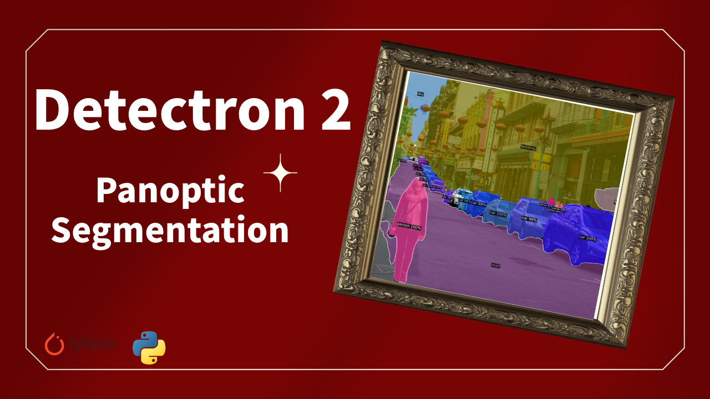

# Panoptic Segmentation using Detectron2

  

##
   

Panoptic segmentation is a challenging task in computer vision that combines instance segmentation and semantic segmentation. Detectron2, a state-of-the-art deep learning library for object detection and segmentation, provides powerful tools for panoptic segmentation. 

With Detectron2, researchers and developers can leverage the latest advancements in deep learning to tackle real-time panoptic segmentation in Python. 

   
By integrating instance and semantic segmentation, panoptic segmentation aims to achieve accurate and comprehensive understanding of visual scenes, enabling advanced applications in areas like autonomous driving, robotics, and image analysis. 

Detectron2 offers an awesome panoptic segmentation model, widely regarded as one of the best panoptic segmentation models available, making it an invaluable resource for image segmentation projects involving AI and deep learning techniques for panoptic photo segmentation.

   

You can find the link for the [tutorial](https://youtu.be/MuzNooUNZSY) here. 

You can find more cool Instance segmentation projects and tutorials in this  [playlist](https://www.youtube.com/playlist?list=PLdkryDe59y4Y24C9LW1AjffKmgGUyaInz)

Enjoy

Eran
   

# Recommended courses and relevant products 

If you are interested in learning modern Computer Vision course with deep dive with TensorFlow , Keras and Pytorch , you can find it [here](http://bit.ly/3HeDy1V).

Perfect course for every computer vision enthusiastic

Before we continue , I actually recommend this [book](https://amzn.to/3STWZ2N) for deep learning based on Tensorflow and Keras : 

# Connect

If you have any suggestions about papers, feel free to mail me :)

- [☕ Buy me a coffee](https://ko-fi.com/eranfeit)
- [🌐 My Website](https://eranfeit.net)
- [▶️ Youtube.com/@eranfeit](https://www.youtube.com/channel/UCTiWJJhaH6BviSWKLJUM9sg)
- [🐙 Facebookl](https://www.facebook.com/groups/3080601358933585)
- [🖥️ Email](mailto:feitgemel@gmail.com)
- [🐦 Twitter](https://twitter.com/eran_feit )
- [😸 GitHub](https://github.com/feitgemel)
- [📸 Instagram](https://www.instagram.com/eran_feit/)
- [🤝 Fiverr ](https://www.fiverr.com/s/mB3Pbb)
- [📝 Medium ](https://medium.com/@feitgemel)

