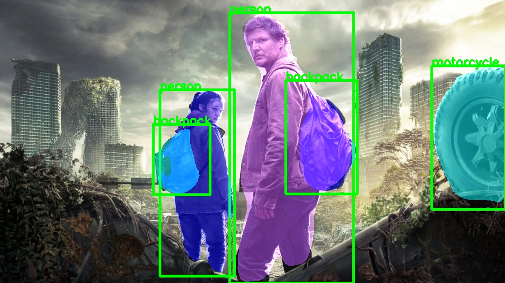

# How I Did Segmentation using Mask R-CNN

  

##
   

🎯 Instance Segmentation with Mask R-CNN in Python — Full Tutorial!

In this tutorial, we’ll walk step-by-step through building a powerful instance segmentation pipeline using Mask R-CNN, PyTorch, and OpenCV — all in Python!
   
🔹 What you’ll learn:

- Load a pretrained Mask R-CNN model from torchvision
- Run instance segmentation on any image (local or URL)
- Apply colored masks and bounding boxes to detected objects
- Display and save the final segmented image with OpenCV
- Use the full list of COCO classes for object labels

   
No dataset needed. No training required.
We’ll use a pretrained model and focus purely on running inference and visualizing results — great for beginners and quick prototypes!
   

You can find the link for the [tutorial](https://youtu.be/YKmHSBfsIGA) here. 

You can find more cool Instance segmentation projects and tutorials in this  [playlist](https://www.youtube.com/playlist?list=PLdkryDe59y4Y24C9LW1AjffKmgGUyaInz)

Enjoy

Eran
   

# Recommended courses and relevant products 

If you are interested in learning modern Computer Vision course with deep dive with TensorFlow , Keras and Pytorch , you can find it [here](http://bit.ly/3HeDy1V).

Perfect course for every computer vision enthusiastic

I also recommend this [book](https://amzn.to/3GBMNLC) : "Practical Machine Learning for Computer Vision" by Oreilly 

# Connect

If you have any suggestions about papers, feel free to mail me :)

- [☕ Buy me a coffee](https://ko-fi.com/eranfeit)
- [🌐 My Website](https://eranfeit.net)
- [▶️ Youtube.com/@eranfeit](https://www.youtube.com/channel/UCTiWJJhaH6BviSWKLJUM9sg)
- [🐙 Facebookl](https://www.facebook.com/groups/3080601358933585)
- [🖥️ Email](mailto:feitgemel@gmail.com)
- [🐦 Twitter](https://twitter.com/eran_feit )
- [😸 GitHub](https://github.com/feitgemel)
- [📸 Instagram](https://www.instagram.com/eran_feit/)
- [🤝 Fiverr ](https://www.fiverr.com/s/mB3Pbb)
- [📝 Medium ](https://medium.com/@feitgemel)

