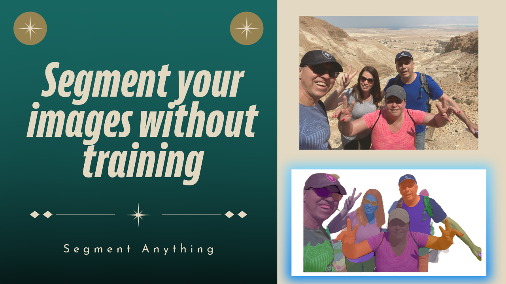

# Segment Anything | Segment Custom image without Training using Segment Anything

  

##
   

Segment Anything: Achieve custom image segmentation effortlessly, no training required.

Image segmentation tasks can be streamlined with Segment Anything, a cutting-edge model that generates accurate masks for any object or region within an image, facilitating efficient object extraction and analysis.

   
In this tutorial we will use your own custom images , and learn how to grabs and tune the mask generation out of those images . 

We will install the relevant Python libraries ,  and write the Python script for this task .

   

You can find the link for the [tutorial](https://youtu.be/8ZkKg9imOH8) here. 

You can find more cool Instance segmentation projects and tutorials in this  [playlist](https://www.youtube.com/playlist?list=PLdkryDe59y4Y24C9LW1AjffKmgGUyaInz)

Enjoy

Eran
   

# Recommended courses and relevant products 

If you are interested in learning modern Computer Vision course with deep dive with TensorFlow , Keras and Pytorch , you can find it [here](http://bit.ly/3HeDy1V).

Perfect course for every computer vision enthusiastic

Before we continue , I actually recommend this [book](https://amzn.to/3STWZ2N) for deep learning based on Tensorflow and Keras : 

# Connect

If you have any suggestions about papers, feel free to mail me :)

- [☕ Buy me a coffee](https://ko-fi.com/eranfeit)
- [▶️ Youtube.com/@eranfeit](https://www.youtube.com/channel/UCTiWJJhaH6BviSWKLJUM9sg)
- [🐙 Facebookl](https://www.facebook.com/groups/3080601358933585)
- [🖥️ Email](mailto:feitgemel@gmail.com)
- [🐦 Twitter](https://twitter.com/eran_feit )
- [😸 GitHub](https://github.com/feitgemel)
- [📸 Instagram](https://www.instagram.com/eran_feit/)
- [🤝 Fiverr ](https://www.fiverr.com/s/mB3Pbb)
- [📝 Medium ](https://medium.com/@feitgemel)

